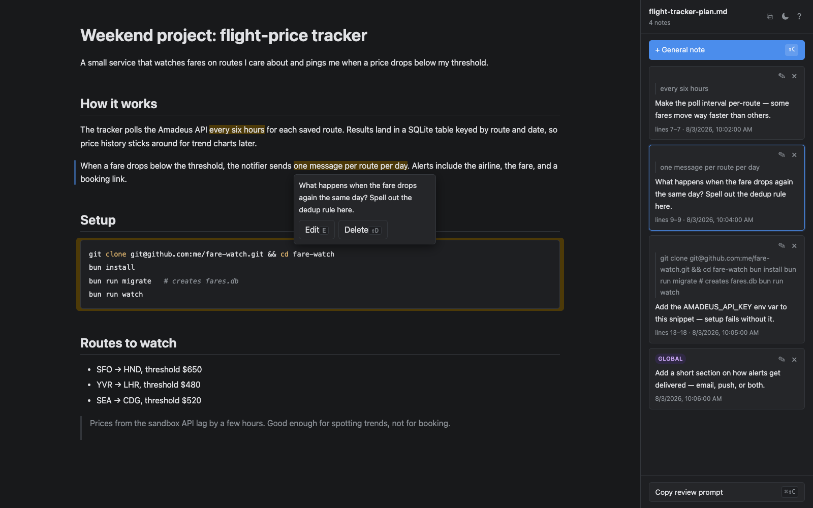

# mdnote

Highlight-and-comment review for Markdown files. Select a span in a rendered doc, attach a note, hand the notes to a coding agent, watch it apply them.

Iterating on Markdown (plans, docs, prompts) with a coding agent usually means typing free-form directions like "in the third paragraph under Setup, change X". mdnote replaces that with direct annotation: you review the rendered document in a browser and mark exactly the spans you mean; the agent reads your notes with precise source locations and edits the file.

<picture>
  <source media="(prefers-color-scheme: light)" srcset="docs/screenshot-light.png">
  
</picture>

## How it works

The server renders your Markdown so that every element carries its source line numbers, which lets a browser text selection map back to exact lines in the file. Each note you leave ("make this punchier", "remove this") persists to a sidecar JSON next to the file, so nothing lives only in the browser tab. The agent never touches the browser: it pulls annotations through the CLI, edits the file, and the page live-reloads with the new content. Annotations follow the text they anchor to as lines shift; one whose text no longer exists is marked stale rather than silently dropped.

## Quick start

```
git clone git@github.com:jlui17/mdnote.git && cd mdnote
bun install
bun link          # puts `mdnote` on your PATH (needs ~/.bun/bin in PATH)
mdnote notes.md
```

The browser opens on the rendered doc. One background server per machine serves every file you open this way — the command exits right after printing the URL, and the server shuts itself down 5 minutes after the last tab closes (`mdnote stop` ends it now). Highlight a span and type a note in the popover — "make this punchier", "remove this paragraph" — and hit ⌘↩ (Ctrl+↩ elsewhere) or the Add button (Esc cancels) (or click "Add general note", or press `Shift+C`, for a doc-wide instruction not tied to a span). To annotate a whole block (paragraph, heading, list item, code fence), hover it — an accent bar marks the target — and click it or press `c`; hovering a list or blockquote's own gutter targets the whole container. Resting the pointer on an annotation — annotated text, or anywhere inside a block annotation's box — opens its note in a popover (move onto the popover to reach Edit or Delete; moving away closes it); clicking pins that popover open and jumps to the note in the sidebar. The ✎ button (or double-clicking the note) edits it in place. A note you were mid-typing survives leaving the tab, a reload, or even closing it: the unsaved draft stays marked in the document with a dashed edge, and clicking it reopens the form with your text (Esc or clicking elsewhere discards a draft; only walking away keeps it). Press `?` (or the ? in the sidebar header) for a cheatsheet of every key and gesture, with your own keybindings filled in.

The page opens in dark mode, or whatever `theme` you set in [Settings](#settings). The ⚙ in the sidebar header opens a settings row: a theme picker that switches between mdnote's own light/dark/system modes and a set of palettes mirroring [daisyUI's themes](https://daisyui.com/docs/themes/) of the same name (dracula, synthwave, nord, cupcake, …), and a reading-line switch (or `r`) that turns on a reading line: a band one text line tall that follows your pointer through the document and stays on the line you left it on while you scroll. Hands off the mouse, `↓` and `↑` step it line by line and scroll the page along with it (with the line off, the arrows scroll as usual). Both choices are written back to your settings file, so they stick across files, tabs, and reloads.

Then an agent (or you, in another terminal) pulls what you left:

```
$ mdnote comments notes.md --json
{
  "file": "notes.md",
  "annotations": [
    {
      "id": "3f1e2b7a-...",
      "lineRange": [12, 14],
      "anchorText": "the quick brown fox",
      "note": "make this punchier",
      "createdAt": "2026-07-30T18:04:00.000Z",
      "status": "open"
    }
  ]
}
```

The agent edits `notes.md` to match the notes, then clears what it addressed:

```
$ mdnote clear notes.md --ids 3f1e2b7a-...
```

The browser page live-reloads on its own. Repeat until `mdnote comments` returns nothing open.

The loop also runs agent-first. Instead of you kicking things off, the agent runs `mdnote wait notes.md`: it opens the page and blocks, and the sidebar shows an agent is waiting with a **Submit** button. Annotate as usual, then click Submit (or hit ⌘↩ / Ctrl+↩) and confirm — the command prints every annotation as JSON and exits, so the agent picks up right where you finished. Submitting with no notes is the "looks good, proceed" signal; the confirmation dialog has a "Don't ask again" checkbox that skips it for the session.

To have Claude Code run this loop itself when you say things like "I left notes", install the skill:

```
mkdir -p ~/.claude/skills/mdnote
ln -s "$(pwd)/SKILL.md" ~/.claude/skills/mdnote/SKILL.md
```

## Settings

An optional `~/.config/mdnote/settings.json` (honors `$XDG_CONFIG_HOME`) overrides the app defaults:

```json
{
  "theme": "dracula",
  "lineNumbers": true,
  "readingLine": true,
  "keybindings": {
    "annotate-block": "mod+p",
    "toggle-theme": "mod+shift+t"
  }
}
```

- **`theme`** — `"dark"` (the default), `"light"`, `"system"` (follow the OS preference), or a named palette: `abyss`, `aqua`, `coffee`, `cupcake`, `cyberpunk`, `dim`, `dracula`, `forest`, `halloween`, `luxury`, `night`, `nord`, `retro`, `sunset`, `synthwave`, `valentine` — each the [daisyUI theme](https://daisyui.com/docs/themes/) of that name, colors verbatim.
- **`lineNumbers`** — `true` shows source line numbers in the preview (default `false`): each top-level block's starting line in a left gutter, and a per-line number column inside code blocks. Prose can't be numbered per visual line — a soft-wrapped paragraph is one source range — so blocks show where they start.
- **`readingLine`** — `true` turns on the reading line (default `false`): a band one text line tall over whichever line the pointer is on, spanning the document's width. It moves only when the pointer does or the arrows step it, so scrolling leaves it on the line it marked.
- **`keybindings`** — action → shortcut, merged over the defaults; `null` unbinds a default. A spec is `mod`/`shift`/`alt` modifiers plus a key, joined by `+` (`mod` is ⌘ on Mac, Ctrl elsewhere); the key is its `KeyboardEvent.key` name, lowercased (`c`, `enter`, `arrowdown`). Actions: `annotate-block` (default `c`), `annotate-document` (default `shift+c`), `edit-annotation` (default `e`), `delete-annotation` (default `shift+d`), `toggle-reading-line` (default `r`), `reading-line-down` and `reading-line-up` (defaults `arrowdown`/`arrowup`; active only while the reading line is on), `submit-review` (default `mod+enter`), `show-help` (default `shift+?`), and `copy-markdown` and `toggle-theme` (steps to the next theme in the list above; unbound by default).

An invalid entry warns in the server log (`~/.local/state/mdnote/server.log`, truncated each time the server starts) and falls back to the default for that key. Edits apply on page reload; no server restart needed. The theme picker and the reading-line toggle write `theme` and `readingLine` back into this file (creating it if needed) and leave every other key as you wrote it; a file that isn't valid JSON is left alone, and the page says so, until you fix it.

## Remote use

The server binds `127.0.0.1:4820` by default. Reviewing a file on a VM or remote box is the same command with a bind flag:

```
mdnote notes.md --host 0.0.0.0 --port 7777
```

The bind flags take effect on a cold start, so `mdnote stop` first if a loopback server is already running. Open `http://<vm-ip>:7777/<absolute path to notes.md>` (the exact URL is printed) from anywhere that can reach the host. Nothing in the page assumes the browser and server share a machine; securing the port (firewall, tailscale, ssh tunnel) is up to you.

## CLI reference

- **`mdnote <file.md> [--host H] [--port P]`** — opens the file in the browser (loopback only) and exits, starting the background server first if none is running. Defaults to `127.0.0.1:4820`; the document lives at the file's absolute path on that port. `--host`/`--port` apply to a cold start; passing either with values that disagree with the running server is an error telling you to `mdnote stop` first.
- **`mdnote stop`** — stops the background server. It also stops itself after 5 minutes with no open tab, and the next `mdnote <file.md>` cold-starts it again.
- **`mdnote list`** — lists every file open on the running server with its URL; says so and exits 0 if no server is running. The list survives restarts and reboots: paths persist in the state dir, and a cold-started server re-lists the ones whose files still exist and that you've touched in the last two weeks.
- **`mdnote wait <file.md> [--host H] [--port P]`** — opens the file like `mdnote <file.md>` (URL on stderr), then blocks until Submit is clicked in the browser. Stdout is exactly one JSON envelope, `{path, submittedAt, annotations}` with drafts excluded; empty `annotations` means approved as-is. No built-in timeout — kill the process to abandon the wait; a pending wait keeps the server alive like an open tab.
- **`mdnote comments <file.md> [--json]`** — lists annotations (unsaved drafts excluded). `--json` prints `{file, annotations}`; without it, a human-readable list.
- **`mdnote clear <file.md> [--ids ID[,ID...]]`** — clears the listed annotations by `--ids` (comma-separated), or all annotations if omitted.

## Annotation schema

Annotations persist to `<file>.mdnote.json` next to the reviewed file. Alongside them the sidecar keeps `lastRound`, the highest review round submitted so far, so clearing annotations never resets round numbering.

```ts
type AnnotationStatus = "open" | "stale";

interface Annotation {
  id: string;
  lineRange: [number, number] | null; // 1-based inclusive source lines; null for a doc-wide note
  anchorText: string | null;          // exact selected text; null for a doc-wide note
  note: string;
  createdAt: string;
  status: AnnotationStatus;
  block?: true;                       // set when the note targets a whole block, not a text span
  draft?: true;                       // an in-progress note whose form was interrupted; hidden from `comments`
  round?: number;                     // review round the note was first delivered in via Submit; absent until then
}
```

## Live reload and staleness

The server watches both the source file and the sidecar. When the agent edits `notes.md`, the server re-renders it, re-anchors every annotation against the new source, and pushes the update to any open browser tab. An annotation whose anchor text still exists gets an updated `lineRange` and stays `open`; one whose anchor text is gone is marked `stale` instead of silently dropped, so you can re-check it rather than lose it. (An unsaved draft is the exception: with its anchor gone there is nothing left to click, so it's deleted.)
